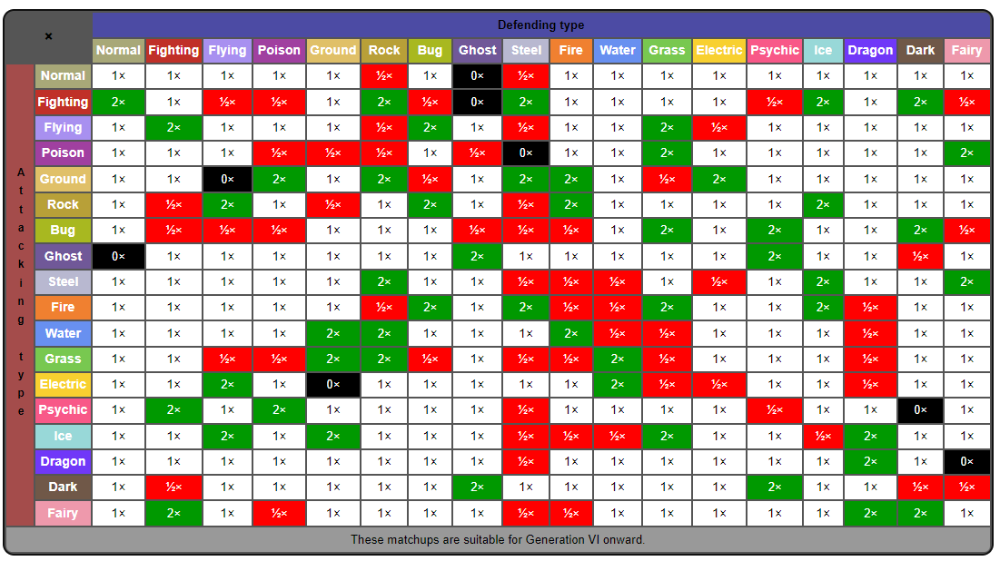

## Resources and Other Links
* [Pokémon Database](https://pokemondb.net/)
* [The Complete Damage Formula for Black & White by Smogon](https://www.smogon.com/bw/articles/bw_complete_damage_formula)
<!-- * [NAME](LINK) -->
<!-- * [NAME](LINK) -->
<!-- * [NAME](LINK) -->

## Wiki Page Links
* [Stats](https://bulbapedia.bulbagarden.net/wiki/Stat)
* [IVs](https://bulbapedia.bulbagarden.net/wiki/Individual_values#Generation_III_onward)
* [Damage](https://bulbapedia.bulbagarden.net/wiki/Damage#Generation_V_onward)
* [Move Priority](https://bulbapedia.bulbagarden.net/wiki/Priority#Mechanics)
* [Natures](https://bulbapedia.bulbagarden.net/wiki/Nature)
* [List of moves](https://bulbapedia.bulbagarden.net/wiki/List_of_moves)
* [Ability](https://bulbapedia.bulbagarden.net/wiki/Ability)
<!-- * [NAME](LINK) -->
<!-- * [NAME](LINK) -->
<!-- * [NAME](LINK) -->

## Type Chart

## Damage Formula
Based off of [this](https://bulbapedia.bulbagarden.net/wiki/Damage#Generation_V_onward) formula

<!-- Damage = [(2*Level)/5]+2 -->
<!-- Level is the level of the attacking Pokémon.

A is the effective Attack stat of the attacking Pokémon if the used move is a physical move, or the effective Special Attack stat of the attacking Pokémon if the used move is a special move (ignoring negative stat stages for a critical hit).

D is the effective Defense stat of the target if the used move is a physical move or a special move that uses the target's Defense stat, or the effective Special Defense of the target if the used move is an other special move (ignoring positive stat stages for a critical hit).

Power is the effective power of the used move.

Critical is 2 for a critical hit, 3 if the move lands a critical hit and the attacker's Ability is Sniper, and 1 otherwise.
https://bulbapedia.bulbagarden.net/wiki/Critical_hit#Probability:~:text=255-,Generation%20II%20onwards,-Damage

random is a random factor. Namely, it is recognized as a multiplication from a random integer between 85 and 100, inclusive, then divided by 100. Decimals are rounded down to the nearest integer.

STAB is the same-type attack bonus. This is equal to 1.5 if the move's type matches any of the user's types, 2 if the user of the move additionally has Adaptability, and 1 if otherwise.

Type is the type effectiveness. This can be 0.125, 0.25, 0.5 (not very effective); 1 (normally effective); 2, 4, or 8 (super effective), depending on both the move's and target's types. -->

## Formulas Being Used
HP stat = [(2 * Base + IV + (EV/4) * Level) / 100] + Level + 10

Other stats = [(2 * Base + IV + (EV/4) * Level) / 100] + 5

*note we are ignoring EVs for now. so we assume anytime we see the EV value pop up that it is 42

*we are also ignoring natures